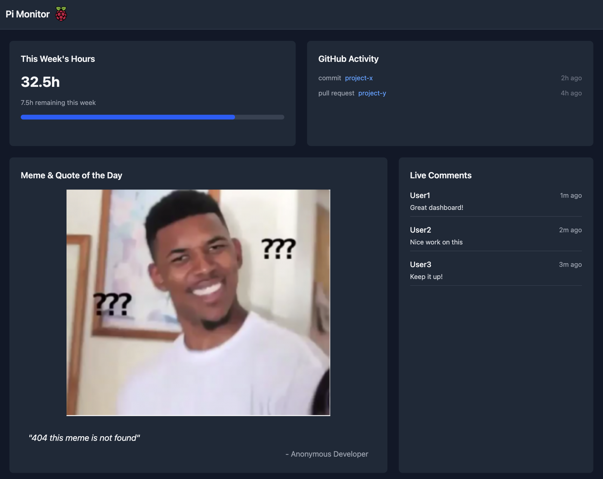

# Pi Monitor Dashboard

A modern, real-time dashboard built with React and TypeScript to monitor personal productivity metrics and development activity.



## Features

- **Work Time Tracking**

  - Monitor daily, weekly, and monthly work hours
  - Visual breakdown of time spent on different projects
  - Real-time updates as you work

- **Git Activity Monitor**

  - View recent commits across repositories
  - Track pull request status
  - Monitor contribution statistics
  - Integration with GitHub/GitLab APIs

- **Live Comments & Notes**

  - Real-time comment section for team collaboration
  - Ability to pin important notes
  - Threaded discussions
  - @mentions support

- **Performance Metrics**
  - Project completion rates
  - Task velocity tracking
  - Productivity trends over time

## Technical Stack

- React + TypeScript
- Tailwind CSS for styling
- Vite for build tooling
- WebSocket for real-time updates
- Docker support for easy deployment

## Getting Started

1. Clone the repository:

```bash
git clone https://github.com/yourusername/pi-monitor.git
```

2. Install dependencies:

```bash
npm install
```

3. Start the development server:

```bash
npm run dev
```
